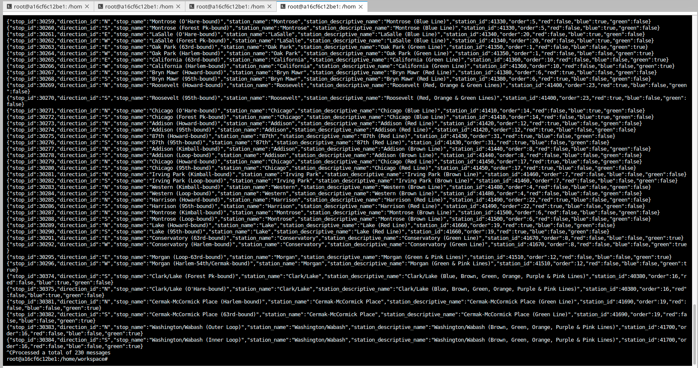

# Optimizing-Public-Transport
Optimizing Public Transport with Apache Kafka

## Overview

Project is based on streaming event pipline with Apache Kafak and ecosystem. With data obtained from Chicago Transit Authority,
an event pipleline with constructed with Apache Kafka to simulate train status in realtime. The realtime data is displayed on 
browser.

## Directions Used In Project
Dashboard was requested by CTA (Chicago Transit Authority) to display train status for its comuters. Apached kafka and ecosystem 
tools like REST Proxy and Kafka Connect are used to accomplish this task. 

1. *Kafka Producers*.
We begin with configurations to emit some events needed. Censors are placed by CTA on each side of station and they have been 
programmed to take action whenever a train arrives or leaves station. 

2. *Configure Kafka REST Proxy Producer*.
Weather readings were demanded by CTA, to be sent into weather hardware by kafka. Unfortunately, this hardware is old and we cannot
use the Python Client Library due to hardware restrictions. Instead, we are going to use HTTP REST to send the data to Kafka from 
hardware using Kafka's REST Proxy. 

3. *Kafka Connect Configuration*.
Since there is need to extract station information form PostgreSQL database inot Kafka, Kafka JDBC Source Connector is a good to go
with. 

4. *Faust Stream Processor Configuration*. 
We leverage Faust Stream Processing to transform the raw Stations table that where ingested from Kafka Connect. The raw format
from the database has more data than was needed, and the line color information was not conveniently configured. For a fix, 
we decided to ingest data from our Kafka Connect Topic, and transform the data.

5. *KSQL Table configuration*.
KSQL is used to aggregate turnstile data for each of our stations. 

6. *Create Kafka Consumers*
Data in server is consumed and display on status page for commuters.

## Running the simulation
There are two pieces of simulation, the `producer` and `consumer`.
Runing the producer.
1. `cd producers`
2. `virtualenv venv`
3. `. venv/bin/activate`
4. `pip install r requirements.txt`
5. `python simulation.py`

Once the consumer is running, you may hit `Ctrl+C` at anytime to exit. 

### To run the Faust Stream Processing Application 

1. `cd consumers`
2. `virtualenv venv`
3. `. venv/bin/activate`
4. `pip install -r requirements.txt`
5. `faust -A faust_stream worker -l info`

### To run the KSQL Creation Script

1. `cd consumers`
2. `virtualenv venv`
3. `. venv/bin/activate`
4. `pip install -r requirements.txt`
5. `python ksql.py`

### To run the consumer (NOTE: Do not run consumer until previous ones have succeeded)
1. `cd consumers`
2. `virtualenv venv`
3. `. venv/bin/activate`
4. `pip install -r requirements.txt`
5. `python server.py`

Once the server is running, you may hit `Ctrl+C` at anytime to exit. 

## Outputs
Station data from consumer
`kafka-console-consumer --bootstrap-server localhost:9092 --topic "org.chicago.cta.stations" --from-beginning` to get the
following output

